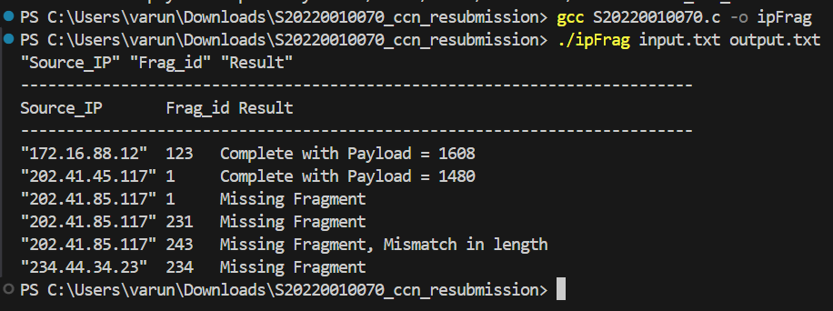

# Fragment Reassembly Program

This program is designed to reassemble fragments of network packets into complete datagrams. It checks for duplicate fragments, missing fragments, and mismatches in offsets to ensure the integrity of the reassembled data.

---

## How to Use

### Prerequisites

Ensure you have a C compiler installed on your system, such as GCC.

---

### Input File

Prepare your input data in a file named `input.txt` in the following format:

```plaintext
"IPsourceaddr" "ID" "fragOffset" "MF" "PayloadLength"
"172.16.88.12" 123 0 1 64
"234.44.34.23" 234 0 1 32
"172.16.88.12" 123 193 0 64
"202.41.85.117" 231 0 1 64
"202.41.85.117" 1 0 1 1480
"172.16.88.12" 123 8 1 1480
"202.41.85.117" 243 2 0 64
"202.41.85.117" 231 0 1 64
"234.44.34.23" 234 1 1 128
"202.41.45.117" 1 0 0 1480
```

Each line represents a fragment of a network packet, with the first line containing column headers. Ensure that the columns are separated by spaces.

---

### Compilation

Compile the program using your preferred C compiler. For example, with GCC, you can use the following command:

```bash
gcc S20220010070.c -o ipFrag
./ipFrag input.txt output.txt
```



---

## Algorithm Used

1. The program iterates through the sorted fragments.
2. For each unique combination of IP address and ID, it attempts to reassemble the fragments into a complete datagram.
3. It keeps track of the current IP address and ID being processed.
4. Within each group, the program checks for various conditions:
   - **Duplicate Fragments**: Identifies if there are multiple fragments with the same offset within the same datagram.
   - **Missing Fragments**: Checks if any expected fragment is missing from the sequence.
   - **Mismatch in Offset**: Verifies if the fragment offsets are sequential as expected.
   - **Mismatch in Length**: Ensures that the total payload length matches the expected length.
5. Based on these checks, the program determines the result for each datagram:
   - If there are duplicate fragments, it reports **"Duplicate fragment"**.
   - If any fragment is missing, it reports **"Missing fragment"**.
   - If there's a mismatch in offset, it reports **"Mismatch in offset"**.
   - If the total payload length doesn't match the expected length, it reports **"Mismatch in length"**.
   - Otherwise, it reports the reassembled datagram's total length.
